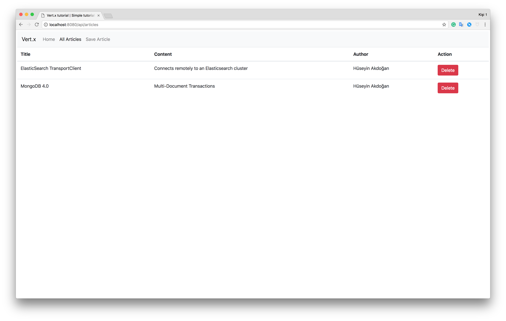

[](https://travis-ci.org/hakdogan/Vert.x)
[](https://www.codacy.com/app/hakdogan/Vert.x?utm_source=github.com&amp;utm_medium=referral&amp;utm_content=hakdogan/Vert.x&amp;utm_campaign=Badge_Grade)
[](https://www.codacy.com/app/hakdogan/Vert.x?utm_source=github.com&utm_medium=referral&utm_content=hakdogan/Vert.x&utm_campaign=Badge_Coverage)

# Vert.x
This repository shows how to use the `Vert.x core`, `web` and `test` module also `mongodb` and `web` client  on a web application which contains RESTful Web Services.

## What you will learn in this repository?
* How to deploy a Verticle
* How to create and use an HTTP server
* How to create a router for web service 
* How to use mongo client and handle CRUD operations
* How to page render with FreeMarkerTemplateEngine
* How to use vertx-unit for tests

### Deploy a Verticle
```java
Vertx vertx = Vertx.vertx();
vertx.deployVerticle(new VerticleRestServer());
```

### Creating a Server and adding a Router to it
```java
private Future<Void> createServer(){

        final Future<Void> future = Future.future();
        final Router router = Router.router(vertx);

        router.route("/*").handler(BodyHandler.create());
        router.get("/").handler(this::welcomePage);
        router.get("/api/articles").handler(this::getArticles);
        router.get("/api/articles/save").handler(this::getSavePage);
        router.post("/api/articles/save").handler(this::saveDocument);
        router.get("/api/articles/remove").handler(this::getDeletePage);
        router.post("/api/articles/remove").handler(this::removeDocument);
        router.get("/api/collection/drop/:name").handler(this::dropCollection);

        vertx.createHttpServer().requestHandler(router::accept)
                .listen(config().getInteger("http.server.port", HTTP_PORT), result -> {
                    if (result.succeeded()) {
                        log.info("HTTP server running on port " + HTTP_PORT);
                        future.complete();
                    } else {
                        log.error("Could not start a HTTP server", result.cause());
                        future.fail(result.cause());
                    }
                });

        return future;
    }
```

### Creating a Mongo Client
```java
final JsonObject mongoConfig = new JsonObject()
    .put("connection_string", DB_URI)
    .put("db_name", DB_NAME);
mongoClient = MongoClient.createShared(vertx, mongoConfig);
```
### Page rendering 
```java
templateEngine.render(routingContext, TEMPLATES_DIRECTORY, url, page -> {
    if (page.succeeded()) {
        routingContext.response().putHeader(CONTENT_TYPE, produceType)
        .setStatusCode(statusCode)
        .end(page.result());
    } else {
        routingContext.fail(page.cause());
    } 
});
```

### Using Web Client in tests
```java
Async async = testContext.async();
WebClient client = WebClient.create(vertx);

client.post(HTTP_PORT, HOSTNAME, "/api/articles/remove")
    .sendJsonObject(new JsonObject().put("id", DOC_ID), req -> {
        if (req.succeeded()) {
            testContext.assertTrue(req.result().bodyAsString().contains("document was deleted"));
            async.complete();
        }
    });
```
                
## How to compile?
```
mvn clean install
```
This repository uses `docker-maven-plugin` for `integration tests` so if you don't have `Docker daemon` you should use `-Dmaven.test.skip=true` parameter with above command.

## How it's run?
```
sh run.sh
```


